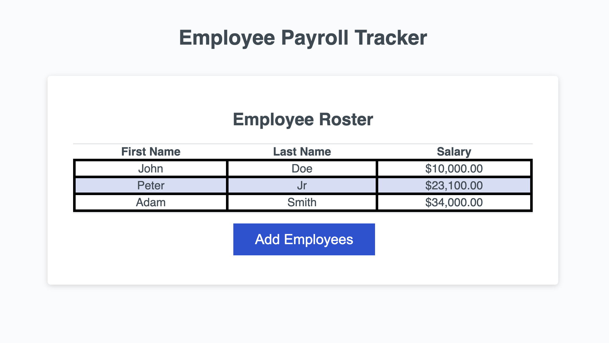
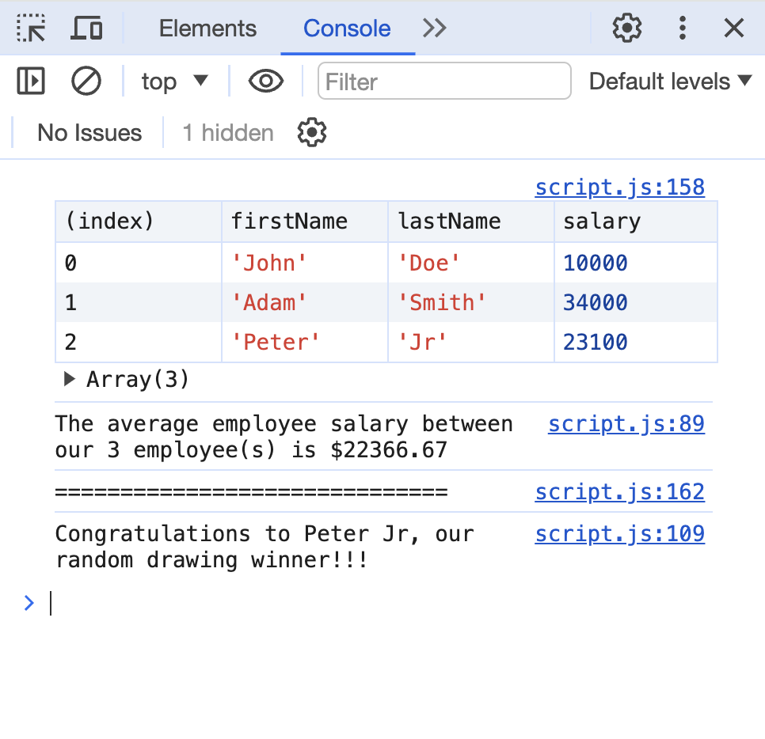
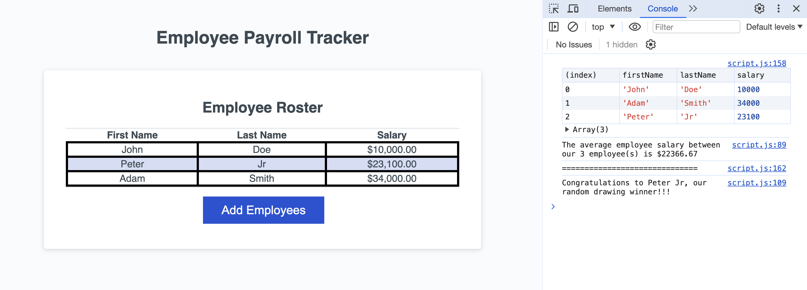

# Employee Payroll Tracker

Employee Payroll Tracker is a web application designed to help businesses manage their employee roster and track important payroll information efficiently.

## Features

- **View Employee Details**: Easily add and view employees' first names, last names, and salaries.
- **Average Salary Calculation**: Quickly calculate and display the average salary of all employees.
- **Random Employee Selection**: Select and display a random employee from the roster.
- **Sortable Employee Table**: Display the employee roster in a table format, sorted by last name.

## Live Demo

Check out the live demo <a href="https://pradeepkhanal23.github.io/payroll-tracker/" target="_blank">Here.</a>

## Screenshots

_Description: Main UI with the add employee button and the table with the employees details._

_Description: Console view of the employee details with average salary and randomly selected employee log._

_Description: Combined view of the table and console._

## Getting Started

1. Clone the repository to your local machine.
2. Open the project directory.
3. Launch the `index.html` file in your preferred web browser.

## Usage

1. Click on the "Add Employees" button to input employee data.
2. Enter the first name, last name, and salary of each employee when prompted.
3. Optionally, add more employees or cancel to finish.
4. View the average salary and a randomly selected employee in the console.
5. The sorted employee (based on the lastname) roster will be displayed in the web page.

## Technologies Used

- HTML
- CSS
- JavaScript

## License

This project is licensed under the [MIT License](LICENSE).
